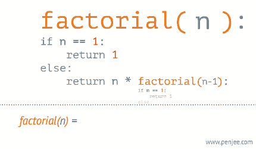

# **Day03笔记**

## **递归**

- **递归定义及特点**

  ```python
  【1】定义
      递归用一种通俗的话来说就是自己调用自己，但是需要分解它的参数，让它解决一个更小一点的问题，当问题小到一定规模的时候，需要一个递归出口返回
      
  【2】特点
      2.1) 递归必须包含一个基本的出口，否则就会无限递归，最终导致栈溢出
      2.2) 递归必须包含一个可以分解的问题
      2.3) 递归必须必须要向着递归出口靠近
  ```

- **递归示例1**

  ```python
  def f(n):
      if n == 0:
          return 
      print(n)
      f(n-1)
  
  f(3)
  # 结果: 3 2 1
  # 调用递归之前的语句,是从外到内执行（递推的过程中依次执行）
  ```

- 


- **递归示例2**

  ```python
  def f(n):
    if n == 0:
      return 
    f(n-1)
    print(n)
    
  f(3)
  # 结果: 1 2 3
  # 调用递归之后的语句，是从内到外执行（是在回归的过程中依次执行）
  ```

  

- **递归示例3**

  ```python
  # 打印 1+2+3+...+n 的和
  def sumn(n):
    if n == 1:
      return 1
    return n + sumn(n-1)
  
  print(sumn(3))
  # 3+2+1
  ```

  

- **递归练习**

  ```python
  # 使用递归求出 n 的阶乘
  def fac(n):
    if n == 1:
      return 1
    return n * fac(n-1)
  
  print(fac(5))
  ```

- **递归总结**

  ```python
  # 前三条必须记住
  【1】递归一定要有出口,一定是先递推,再回归
  【2】调用递归之前的语句，从外到内执行，最终回归
  【3】调用递归或之后的语句，从内到外执行，最终回归
  
  【4】Python默认递归深度有限制，当递归深度超过默认值时，就会引发RuntimeError，默认值998
  【5】手动设置递归调用深度
      import sys
      sys.setrecursionlimit(1000000) #表示递归深度为100w
  ```

- **递归动态图解一**

  

- **递归动态图解二**

  

- **递归动态图解三**

  

## **深度遍历代码实现**

```python
【1】遍历
    沿某条搜索路径周游二叉树，对树中的每一个节点访问一次且仅访问一次。

【2】遍历方式
    2.1) 前序遍历： 先访问树根，再访问左子树，最后访问右子树 - 根 左 右
    2.2) 中序遍历： 先访问左子树，再访问树根，最后访问右子树 - 左 根 右
    2.3) 后序遍历： 先访问左子树，再访问右子树，最后访问树根 - 左 右 根
```


```python
【1】前序遍历结果: 1 2 4 8 9 5 10 3 6 7
【2】中序遍历结果: 8 4 9 2 10 5 1 6 3 7
【3】后序遍历结果: 8 9 4 10 5 2 6 7 3 1
```

- **深度遍历 - 代码实现**

  ```python
  # 前序遍历
      def pre_travel(self, node):
          """前序遍历 - 根左右"""
          if node is None:
              return
  
          print(node.value, end=' ')
          self.pre_travel(node.left)
          self.pre_travel(node.right)
  
  # 中序遍历
      def mid_travel(self, node):
          """中序遍历 - 左根右"""
          if node is None:
              return
  
          self.mid_travel(node.left)
          print(node.value, end=' ')
          self.mid_travel(node.right)
  
  # 后续遍历
      def last_travel(self, node):
          """后序遍历 - 左右根"""
          if node is None:
              return
  
          self.last_travel(node.left)
          self.last_travel(node.right)
          print(node.value, end=' ')
  ```

- **二叉树完整代码**

  ```python
  """
  python实现二叉树
  """
  
  class Node:
      def __init__(self, value):
          self.value = value
          self.left = None
          self.right = None
  
  class Tree:
      def __init__(self, node=None):
          """创建了一棵空树或者是只有树根的树"""
          self.root = node
  
      def add(self, value):
          """在树中添加一个节点"""
          node = Node(value)
          # 空树情况
          if self.root is None:
              self.root = node
              return
  
          # 不是空树的情况
          node_list = [self.root]
          while node_list:
              cur = node_list.pop(0)
              # 判断左孩子
              if cur.left is None:
                  cur.left = node
                  return
              else:
                  node_list.append(cur.left)
  
              # 判断右孩子
              if cur.right is None:
                  cur.right = node
                  return
              else:
                  node_list.append(cur.right)
  
      def breadth_travel(self):
          """广度遍历 - 队列思想（即：列表的append()方法 和 pop(0) 方法"""
          # 1、空树的情况
          if self.root is None:
              return
          # 2、非空树的情况
          node_list = [self.root]
          while node_list:
              cur = node_list.pop(0)
              print(cur.value, end=' ')
              # 添加左孩子
              if cur.left is not None:
                  node_list.append(cur.left)
              # 添加右孩子
              if cur.right is not None:
                  node_list.append(cur.right)
  
          print()
  
      def pre_travel(self, node):
          """前序遍历 - 根左右"""
          if node is None:
              return
  
          print(node.value, end=' ')
          self.pre_travel(node.left)
          self.pre_travel(node.right)
  
      def mid_travel(self, node):
          """中序遍历 - 左根右"""
          if node is None:
              return
  
          self.mid_travel(node.left)
          print(node.value, end=' ')
          self.mid_travel(node.right)
  
      def last_travel(self, node):
          """后序遍历 - 左右根"""
          if node is None:
              return
  
          self.last_travel(node.left)
          self.last_travel(node.right)
          print(node.value, end=' ')
  
  if __name__ == '__main__':
      tree = Tree()
      tree.add(1)
      tree.add(2)
      tree.add(3)
      tree.add(4)
      tree.add(5)
      tree.add(6)
      tree.add(7)
      tree.add(8)
      tree.add(9)
      tree.add(10)
      # 广度遍历：1 2 3 4 5 6 7 8 9 10
      tree.breadth_travel()
      # 前序遍历：1 2 4 8 9 5 10 3 6 7
      tree.pre_travel(tree.root)
      print()
      # 中序遍历:8 4 9 2 10 5 1 6 3 7
      tree.mid_travel(tree.root)
      print()
      # 后序遍历：8 9 4 10 5 2 6 7 3 1
      tree.last_travel(tree.root)
  ```

- **二叉树和递归练习题**

  ```python
  【1】给定一棵二叉搜索树,请找出其中第k小的节点
      # 二叉搜索树中序遍历的结果是递增的序列
      def get_k_node(root, k):
          pass
      
  【2】一个青蛙一次可以跳1级台阶或2级台阶,一共有n级台阶,问青蛙跳到顶部有几种跳法
    思路一：举例大法(找规律-斐波那契数列)
           1级台阶：1
           2级台阶：2
           3级台阶：3
           4级台阶：5
           5级台阶：8
           ... ..
    思路二：递归思想(f(n))
          考虑最后一跳,最后一跳跳到顶部共有2种跳法
          最后一跳(1级台阶): f(n-1)
          最后一跳(2级台阶): f(n-2)
          总的跳法的种类：f(n) = f(n-1) + f(n-2)
  
  def f(n):
      # 递归出口
      if n == 1:
          return 1
      if n == 2:
          return 2
      
      return f(n-1) + f(n-2)
  ```

## **冒泡排序**

- **排序方式**

  ```python
  # 排序方式
  遍历列表并比较相邻的元素对，如果元素顺序错误，则交换它们。重复遍历列表未排序部分的元素，直到完成列表排序
  
  # 时间复杂度
  因为冒泡排序重复地通过列表的未排序部分，所以它具有最坏的情况复杂度O(n^2)
  ```


- **代码实现**

  ```python
  """
  冒泡排序
  3 8 2 5 1 4 6 7
  """
  def bubble_sort(li):
      # 代码第2步: 如果不知道循环几次，则举几个示例来判断
      for j in range(0,len(li)-1):
          # 代码第1步: 此代码为一波比对，此段代码一定一直循环，一直比对多次至排序完成
          for i in range(0,len(li)-j-1):
              if li[i] > li[i+1]:
                  li[i],li[i+1] = li[i+1],li[i]
  
      return li
  
  li = [3,8,2,5,1,4,6,7]
  print(bubble_sort(li))
  ```

## **归并排序**

- **排序规则**

  ```python
  # 思想
  分而治之算法
  
  # 步骤
  1) 连续划分未排序列表，直到有N个子列表，其中每个子列表有1个"未排序"元素，N是原始数组中的元素数
  2) 重复合并，即一次将两个子列表合并在一起，生成新的排序子列表，直到所有元素完全合并到一个排序数组中
  ```

  

  

- **代码实现 - 归并排序**

  ```python
  """
  归并排序
  """
  
  def merge_sort(li):
      # 递归出口
      if len(li) == 1:
          return li
  
      # 第1步：先分
      mid = len(li) // 2
      left = li[:mid]
      right = li[mid:]
      # left_li、right_li 为每层合并后的结果,从内到外
      left_li = merge_sort(left)
      right_li = merge_sort(right)
  
      # 第2步：再合
      return merge(left_li,right_li)
  
  # 具体合并的函数
  def merge(left_li,right_li):
      result = []
      while len(left_li)>0 and len(right_li)>0:
          if left_li[0] <= right_li[0]:
              result.append(left_li.pop(0))
          else:
              result.append(right_li.pop(0))
      # 循环结束,一定有一个列表为空,将剩余的列表元素和result拼接到一起
      result += left_li
      result += right_li
  
      return result
  
  if __name__ == '__main__':
      li = [1,8,3,5,4,6,7,2]
      print(merge_sort(li))
  ```

## **快速排序**

- **排序规则**

  ```python
  【1】介绍
      快速排序也是一种分而治之的算法，在大多数标准实现中，它的执行速度明显快于归并排序
  
  【2】排序步骤：
      2.1) 首先选择一个元素，称为数组的基准元素
      2.2) 将所有小于基准元素的元素移动到基准元素的左侧；将所有大于基准元素的移动到基准元素的右侧
      2.3) 递归地将上述两个步骤分别应用于比上一个基准元素值更小和更大的元素的每个子数组
  ```

  

- **代码实现 - 快速排序**

  ```python
  """
  快速排序
      1、left找比基准值大的暂停
      2、right找比基准值小的暂停
      3、交换位置
      4、当right<left时，即为基准值的正确位置，最终进行交换
  """
  def quick_sort(li, first, last):
      if first > last:
          return
  
      # 找到基准值的正确位置下表索引
      split_pos = part(li, first, last)
      # 递归思想,因为基准值正确位置左侧继续快排,基准值正确位置的右侧继续快排
      quick_sort(li, first, split_pos-1)
      quick_sort(li, split_pos+1, last)
  
  
  def part(li, first, last):
      """找到基准值的正确位置,返回下标索引"""
      # 基准值、左游标、右游标
      mid = li[first]
      lcursor = first + 1
      rcursor = last
      sign = False
      while not sign:
          # 左游标右移 - 遇到比基准值大的停
          while lcursor <= rcursor and li[lcursor] <= mid:
              lcursor += 1
          # 右游标左移 - 遇到比基准值小的停
          while lcursor <= rcursor and li[rcursor] >= mid:
              rcursor -= 1
          # 当左游标 > 右游标时,我们已经找到了基准值的正确位置,不能再移动了
          if lcursor > rcursor:
              sign = True
              # 基准值和右游标交换值
              li[first],li[rcursor] = li[rcursor],li[first]
          else:
              # 左右游标互相交换值
              li[lcursor],li[rcursor] = li[rcursor],li[lcursor]
  
      return rcursor
  
  if __name__ == '__main__':
      li = [6,5,3,1,8,7,2,4,6,5,3]
      quick_sort(li, 0, len(li)-1)
  
      print(li)
  ```

## **二分查找**

- **定义及规则**

  ```python
  【1】定义及优点
  	二分查找又称折半查找，优点是比较次数少，查找速度快，平均性能好
  
  【2】查找过程
  　　二分查找即搜索过程从数组的中间元素开始,如果中间元素正好是要查找的元素,则搜索过程结束;如果中间元素大于或小于要查找元素,则在小于或大于中间元素的那一半进行搜索,而且跟开始一样从中间元素开始比较. 如果在某一步骤数组为空,则代表找不到.这种算法每一次比较都会使搜索范围缩小一半.
  
  【3】适用条件
  	'数组必须有序'
  ```

- **二分查找图解一**

  

- **二分查找图解二**

  

- **代码实现**

  ```python
  def binary_search(alist, item):
      """
      二分查找
      """
      n = len(alist)
      first = 0
      last = n - 1
      while first <= last:
          mid = (last+first)//2
          if alist[mid] > item:
              last = mid - 1
          elif alist[mid] < item:
              first = mid + 1
          else:
              return True
      return False
  
  if __name__ == "__main__":
      lis = [2, 4, 5, 12, 14, 23]
      if binary_search(lis, 12):
          print('ok')
      else:
          print('false')
  ```

  


