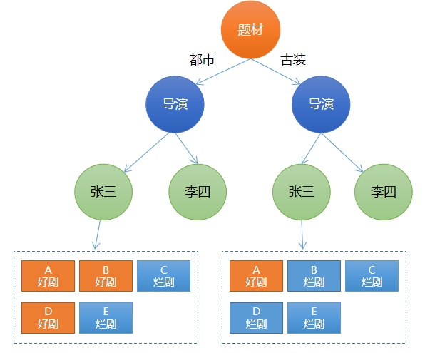

# 一、决策树分类

## 1. 决策树分类原理

决策树可以作为分类器使用，从而实现分类问题。使用决策树实现分类时，先根据不同特征将样本划分到不同叶子节点，再根据投票法（少数服从多数）决定预测结果属于哪个类别，预测类别即同一个子节点下数量最多的样本的类别。例如，预测一部电视剧是好剧还是烂剧，可以用以下决策树来实现：



根据以上决策树模型，可以做这样的分类预测：

- 如果是都市题材，导演为张三，好剧的数量较多，预测结果为好剧；
- 如果是古装题材，导演为张三，烂剧的数据量较多，预测结果为烂剧. 


## 2. 决策树分类案例

sklearn中， 提供了以下API实现决策树分类器或随机森林分类器：

```python
sklearn.tree.DecisionTreeClassifier() # 决策树分类器
sklearn.ensembleRandomForestClassifier() # 随机森林分类器
```


该示例中，根据一组小汽车样本数据，该组样本数据统计了小汽车常见特征信息及其分类，特征包括：汽车价格、维修费用、车门数量、载客数、后备箱、安全性，标签为汽车质量。各属性取值如下表所示：

| 索引-名称  | 取值范围                | 含义说明   |
| ---------- | ----------------------- | ---------- |
| 1-buying   | vhigh, high, med, low   | 购买价格   |
| 2-maint    | vhigh, high, med, low   | 维护费用   |
| 3-doors    | 2, 3, 4, 5more          | 车门数量   |
| 4-persons  | 2, 4, more              | 载客数     |
| 5-lug_boot | small, med, big         | 后备箱大小 |
| 6-safety   | low, med, high          | 安全性     |
| 标签       | unacc, acc, good, vgood | 汽车质量   |


以下是使用决策树进行分类的示例代码。

```python
# 决策树分类示例
import numpy as np
import sklearn.preprocessing as sp
import sklearn.ensemble as se
import sklearn.model_selection as ms

raw_samples = []  # 保存一行样本数据
with open("../data/car.txt", "r") as f:
    for line in f.readlines():
        raw_samples.append(line.replace("\n", "").split(","))

data = np.array(raw_samples).T  # 转置
encoders = []  # 记录标签编码器
train_x = []  # 编码后的x

# 对样本数据进行标签编码
for row in range(len(data)):
    encoder = sp.LabelEncoder()  # 创建标签编码器
    encoders.append(encoder)
    if row < len(data) - 1:  # 不是最后一行，为样本特征
        lbl_code = encoder.fit_transform(data[row])  # 编码
        train_x.append(lbl_code)
    else:  # 最后一行，为样本输出
        train_y = encoder.fit_transform(data[row])

train_x = np.array(train_x).T  # 转置回来，变为编码后的数组
print(train_x)

# 创建随机森林分类器
model = se.RandomForestClassifier(max_depth=8,  # 最大树高
                                  n_estimators=150,  # 评估系数
                                  random_state=7)  # 随机种子
# 训练
model.fit(train_x, train_y)
print("accuracy:", model.score(train_x, train_y)) # 打印平均精度

# 预测
## 待预测数据
data = [['high', 'med', '5more', '4', 'big', 'low'],
        ['high', 'high', '4', '4', 'med', 'med'],
        ['low', 'low', '2', '2', 'small', 'high'],
        ['low', 'med', '3', '4', 'med', 'high']]
data = np.array(data).T
test_x = []
for row in range(len(data)):
    encoder = encoders[row]  # 取得每列对应的标签编码器
    test_x.append(encoder.transform(data[row]))  # 待预测数据编码

test_x = np.array(test_x).T  # 转置回来

pred_test_y = model.predict(test_x)  # 执行预测

pred_test_y = encoders[-1].inverse_transform(pred_test_y)  # 预测结果反向编码
print("pred_test_y:", pred_test_y)  # 预测结果
```

执行结果：

```
accuracy: 0.9704861111111112
pred_test_y: ['unacc' 'acc' 'unacc' 'vgood']
```

