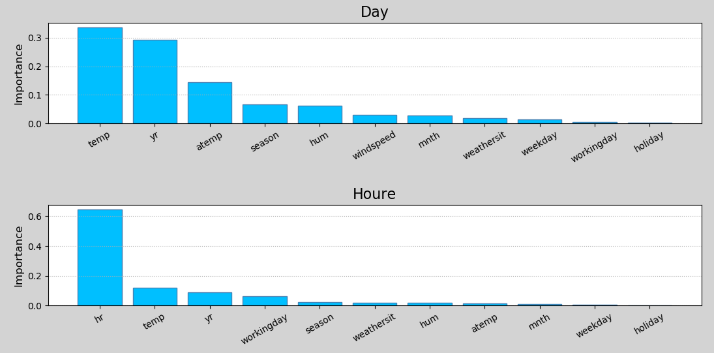
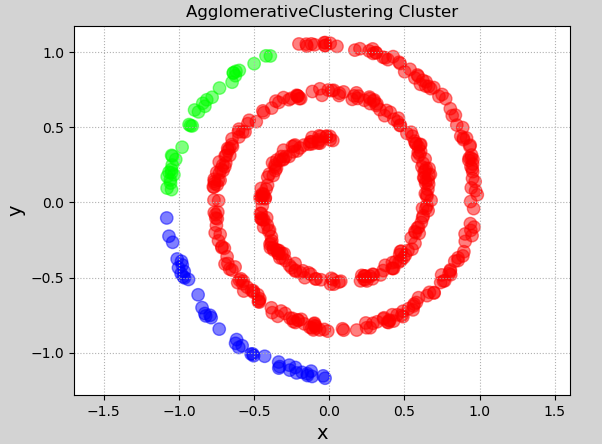
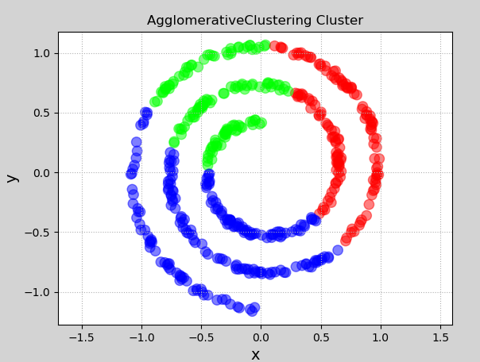

# 机器学习补充练习

## 示例1：线性回归

读取single.txt文件中的样本，定义线性回归模型，并训练，绘制训练的模型，打印模型的R2分数

```python
# 线性回归示例
import numpy as np
# 线性模型
import sklearn.linear_model as lm
# 模型性能评价模块
import sklearn.metrics as sm
import matplotlib.pyplot as mp

x, y = [], []   # 输入、输出样本
with open("single.txt", "rt") as f:
    for line in f.readlines():
        data = [float(substr) for substr in line.split(",")]
        x.append(data[:-1])
        y.append(data[-1])

x = np.array(x)  # 二维数据形式的输入矩阵，一行一样本，一列一特征
y = np.array(y)  # 一维数组形式的输出序列，每个元素对应一个输入样本
print(x)
print(y)

# 创建线性回归器
model = lm.LinearRegression()
# 用已知输入、输出数据集训练回归器
model.fit(x, y)	
# 根据训练模型预测输出
pred_y = model.predict(x)

# 评估指标
err = sm.mean_absolute_error(y, pred_y) # 评价绝对值误差
print(err)
err2 = sm.mean_squared_error(y, pred_y) # 平均平方误差
print(err2)
err3 = sm.median_absolute_error(y, pred_y) # 中位绝对值误差
print(err3)
err4 = sm.r2_score(y, pred_y)  # R2得分, 范围[0, 1], 分值越大越好
print(err4)

# 可视化回归曲线
mp.figure('Linear Regression', facecolor='lightgray')
mp.title('Linear Regression', fontsize=20)
mp.xlabel('x', fontsize=14)
mp.ylabel('y', fontsize=14)
mp.tick_params(labelsize=10)
mp.grid(linestyle=':')
# 绘制样本点
mp.scatter(x, y, c='dodgerblue', alpha=0.8, s=60, label='Sample')
# 绘制拟合直线
sorted_indices = x.T[0].argsort()
mp.plot(x[sorted_indices], pred_y[sorted_indices], c='orangered', label='Regression')

mp.legend()
mp.show()
```


## 示例2：利用随机森林实现共享单车投放量预测

- 数据集：一段时期内共享单车使用量，特征：日期、季节、年、月、小时、是否是假期、星期几、是否为工作日、天气、温度、体感温度、湿度、风速；标签：游客使用量、注册用户使用量、总使用量
- 实现代码：

```python
# -*- coding: utf-8 -*-
# 使用随机森林实现共享单车使用量预测

import csv
import numpy as np
import sklearn.utils as su
import sklearn.ensemble as se
import sklearn.metrics as sm
import matplotlib.pyplot as mp

# 读取共享单车使用率文件中的数据
############### 基于天的数据训练与预测 ###############
with open("bike_day.csv", "r") as f:
    reader = csv.reader(f)
    x, y = [], []
    for row in reader:
        x.append(row[2:13])  # 第1列序号掐掉, 挑出其中的输入
        y.append(row[-1])  # 最后一列是输出

fn_dy = np.array(x[0]) # 保存特征名称
x = np.array(x[1:], dtype=float) # 去掉第1行标题部分
y = np.array(y[1:], dtype=float) # 去掉第1行标题部分

# 将矩阵打乱
x = su.shuffle(x, random_state=7)
y = su.shuffle(y, random_state=7)

# 计算训练数据的笔数，创建训练集、测试集
train_size = int(len(x) * 0.9)  # 用90%的数据来训练模型

train_x = x[:train_size]  # 训练输入
train_y = y[:train_size]  # 训练输出

test_x = x[train_size:]  # 测试输入
test_y = y[train_size:]  # 测试输出

# 创建随机森林回归器，并进行训练
model = se.RandomForestRegressor(max_depth=10, #最大深度
                                 n_estimators=1000, #树数量
                                 min_samples_split=2) #最小样本数量，小于该数就不再划分子节点
model.fit(train_x, train_y)  # 训练

# 基于天统计数据的特征重要性
fi_dy = model.feature_importances_
# print(fi_dy)
pre_test_y = model.predict(test_x)
print(sm.r2_score(test_y, pre_test_y)) #打印r2得分

# 可视化
mp.figure('Bike', facecolor='lightgray')
mp.subplot(211)
mp.title('Day', fontsize=16)
mp.ylabel('Importance', fontsize=12)
mp.tick_params(labelsize=10)
mp.grid(axis='y', linestyle=':')
sorted_idx = fi_dy.argsort()[::-1]
pos = np.arange(sorted_idx.size)
mp.bar(pos, fi_dy[sorted_idx], facecolor='deepskyblue', edgecolor='steelblue')
mp.xticks(pos, fn_dy[sorted_idx], rotation=30)

############### 基于小时的数据训练与预测 ###############
with open("bike_hour.csv", "r") as f_hr:
    reader = csv.reader(f_hr)
    x, y = [], []
    for row in reader:
        x.append(row[2:13])  # 第1列序号掐掉, 挑出其中的输入
        y.append(row[-1])  # 输出

fn_hr = np.array(x[0])

x = np.array(x[1:], dtype=float)
y = np.array(y[1:], dtype=float)

x = su.shuffle(x, random_state=7)
y = su.shuffle(y, random_state=7)

# 计算训练数据的笔数，创建训练集、测试集
train_size = int(len(x) * 0.9)
train_x = x[:train_size] # 训练输入
train_y = y[:train_size] # 训练输出
test_x = x[train_size:]  # 测试输入
test_y = y[train_size:]  # 测试输出

# 创建随机森林回归器，并进行训练
model = se.RandomForestRegressor(max_depth=10, n_estimators=1000, min_samples_split=2)
model.fit(train_x, train_y)

fi_hr = model.feature_importances_  # 基于小时数据的特征重要性
pre_test_y = model.predict(test_x)
print(sm.r2_score(test_y, pre_test_y)) #打印r2得分

#可视化
mp.subplot(212)
mp.title('Houre', fontsize=16)
mp.ylabel('Importance', fontsize=12)
mp.tick_params(labelsize=10)
mp.grid(axis='y', linestyle=':')
sorted_idx = fi_hr.argsort()[::-1]
pos = np.arange(sorted_idx.size)
mp.bar(pos, fi_hr[sorted_idx], facecolor='deepskyblue', edgecolor='steelblue')
mp.xticks(pos, fn_hr[sorted_idx], rotation=30)

mp.tight_layout()
mp.show()
```

- 打印输出

```
0.8915180372559434
0.9185448658002986
```

- 特征重要性可视化

  


## 示例3：利用SVM预测交通流量

利用支持向量机预测体育场馆周边交通流量。样本特征分别为：星期、时间、对手球队、棒球比赛是否正在进行、通行汽车数量。

```python
# 利用支持向量机实现交通流量预测
# 数据集：17568笔样本
# 特征分别为星期、时间、对手球队、棒球比赛是否正在进行，标签为通行汽车数量
import numpy as np
import sklearn.model_selection as ms
import sklearn.svm as svm
import sklearn.metrics as sm
import matplotlib.pyplot as mp
import sklearn.preprocessing as sp

# 自定义编码器
class DigitEncoder():
    def fit_transform(self, x):
        return x.astype(int)

    def transform(self, x):
        return x.astype(int)

    def inverse_transform(self, x):
        return x.astype(str)


data = []
with open("../data/traffic.txt", "r") as f:
    for line in f.readlines():
        line = line.replace("\n", "")
        data.append(line.split(","))
data = np.array(data).T

encoders, x = [], []
for row in range(len(data)):
    if data[row, 0].isdigit(): # 数值，使用自定义编码器
        encoder = DigitEncoder()
    else: # 字符串，使用标签编码器
        encoder = sp.LabelEncoder()

    if row < len(data) - 1: # 不是最后一行：特征
        x.append(encoder.fit_transform(data[row]))
    else: # 最后一行：标签
        y = encoder.fit_transform(data[row])

    encoders.append(encoder) # 记录编码器

x = np.array(x).T # 转置还原

# 划分训练集、测试集
train_x, test_x, train_y, test_y = ms.train_test_split(
    x, y, test_size=0.25, random_state=5)

# 基于径向基核函数的支持向量机回归器
model = svm.SVR(kernel="rbf", C=10, epsilon=0.2)
model.fit(train_x, train_y)
pred_test_y = model.predict(test_x)

print("r2_score:", sm.r2_score(test_y, pred_test_y))

data = [["Tuesday", "13:35", "San Francisco", "yes"]]  # 待预测数据
data = np.array(data).T
x = []
# 对样本进行编码
for row in range(len(data)):
    encoder = encoders[row]
    x.append(encoder.transform(data[row]))

x = np.array(x).T
pred_y = model.predict(x)
print(int(pred_y))
```

执行结果：

```
r2_score: 0.6379517119380995
27
```


## 示例 4：凝聚层次对中心不明显的数据聚类

下面来看一个中心点不明显的凝聚层次聚类示例. 

```python
# 凝聚层次聚类示例
import numpy as np
import sklearn.cluster as sc
import matplotlib.pyplot as mp
import sklearn.neighbors as nb

n_sample = 500
t = 2.5 * np.pi * (1 + 2 * np.random.rand(n_sample, 1))  # 产生随机角度

# 产生数据样本(阿基米德螺线)
x = 0.05 * t * np.cos(t)
y = 0.05 * t * np.sin(t)
n = 0.05 * np.random.rand(n_sample, 2) # 产生随机噪声

x = np.hstack((x, y)) + n # 水平合并


# 无连续性凝聚层次聚类器
# model = sc.AgglomerativeClustering(n_clusters=3, linkage="average")
# model.fit(x)   # 训练
# pred_y1 = model.labels_   # 聚类标签（聚类结果）

# 有连续性凝聚层次聚类器
conn = nb.kneighbors_graph(x, 10, include_self=False) # 创建每个样本的近邻集合
model = sc.AgglomerativeClustering(n_clusters=3,
                    linkage="average",
                    connectivity=conn) # 在凝聚过程中优先选择近邻中连续性最好的样本，优先凝聚
model.fit(x)   # 训练
pred_y1 = model.labels_   # 聚类标签（聚类结果）


# 可视化
mp.figure("AgglomerativeClustering Cluster", facecolor="lightgray")
mp.title("AgglomerativeClustering Cluster")
mp.xlabel("x", fontsize=14)
mp.ylabel("y", fontsize=14)
mp.tick_params(labelsize=10)
mp.grid(linestyle=":")
mp.axis("equal")
mp.scatter(x[:, 0], x[:, 1], c=pred_y1, cmap="brg", s=80, alpha=0.5)
mp.show()
```

执行结果（有连续层次）：



因为是随机产生数据，该程序每次执行结果都不一样.  可以将代码22~24行注释打开，27~30行注释，就是一个非连续凝聚层次聚类. 执行结果：



##  示例5：利用SVM实现图像分类

- 数据集：包含两个目录train和test，每个目录下三个类别水果，apple、banana、grape
- 代码：

```python
# -*- coding: utf-8 -*-
import os
import numpy as np
import cv2 as cv
import sklearn.metrics as sm
import sklearn.preprocessing as sp
import sklearn.svm as svm

name_dict = {"apple": 0, "banana": 1, "grape": 2}


# 读取图片、类别，并且存入字典
def search_samples(dir_path):
    img_samples = {}

    dirs = os.listdir(dir_path)
    for d in dirs:
        sub_dir_path = dir_path + "/" + d  # 拼接子目录完整路径
        if not os.path.isdir(sub_dir_path):  # 不是子目录
            continue

        imgs = os.listdir(sub_dir_path)  # 列出子目录中所有文件
        for img_file in imgs:
            img_path = sub_dir_path + "/" + img_file  # 拼接完整路径

            if d in img_samples:  # 该类别已经在字典中
                img_samples[d].append(img_path)
            else:
                img_list = []  # 定义空列表
                img_list.append(img_path)  # 将图像加入列表
                img_samples[d] = img_list

    return img_samples


train_samples = search_samples('../data/fruits_tiny/train')  # 搜索所有图像样本
train_x, train_y = [], []

# 加载训练集样本数据，训练模型，模型存储
for label, img_list in train_samples.items():
    descs = np.array([])

    for img_file in img_list:
        # 读取原始图像，并转为灰度图像
        print("读取样本:", img_file)
        im = cv.imread(img_file)
        im_gray = cv.cvtColor(im, cv.COLOR_BGR2GRAY)

        # 调整大小
        h, w = im_gray.shape[:2]  # 取出高度、宽度
        f = 200 / min(h, w)  # 计算缩放比率
        im_gray = cv.resize(im_gray, None, fx=f, fy=f)  # 图像缩放

        # 计算特征矩阵
        sift = cv.xfeatures2d.SIFT_create()
        keypoints = sift.detect(im_gray)
        _, desc = sift.compute(im_gray, keypoints)

        # 添加到样本、输出数组
        # print("desc.shape:", desc.shape)
        desc = np.sum(desc, axis=0) # 0-列方向
        train_x.append(desc)  # 图像数据特征
        train_y.append(name_dict[label])  # 标签

train_x = np.array(train_x)
train_y = np.array(train_y)
# print("train_y.shape:", train_y.shape)

# 定义模型、训练
print("开始训练......")

model = svm.SVC(kernel='poly', degree=2)
model.fit(train_x, train_y)

print("训练结束.")

# 测试模型
test_samples = search_samples('../data/fruits_tiny/test')
test_x, test_y = [], []

# 读取测试数据，并计算特征值
for label, filenames in test_samples.items():
    descs = np.array([])

    for img_file in filenames:
        print("读取测试样本:", img_file)

        # 读取原始图像，并转为灰度图像
        image = cv.imread(img_file)
        gray = cv.cvtColor(image, cv.COLOR_BGR2GRAY)

        # 调整大小
        h, w = gray.shape[:2]
        f = 200 / min(h, w)
        gray = cv.resize(gray, None, fx=f, fy=f)

        # 计算特征矩阵
        sift = cv.xfeatures2d.SIFT_create()
        keypoints = sift.detect(gray)
        _, desc = sift.compute(gray, keypoints)

        # 添加测试输入、输出数组
        desc = np.sum(desc, axis=0)# 0-列方向
        test_x.append(desc)
        test_y.append(name_dict[label])  # 标签

# 执行预测
print("开始预测......")
pred_test_y = model.predict(test_x)
print("预测结束.")

# 打印分类报告
print(sm.classification_report(test_y, pred_test_y))
```

执行结果：

```
中间打印省略......         

             precision    recall  f1-score   support

           0       1.00      0.80      0.89        10
           1       1.00      1.00      1.00        10
           2       0.83      1.00      0.91        10

    accuracy                           0.93        30
   macro avg       0.94      0.93      0.93        30
weighted avg       0.94      0.93      0.93        30
```

